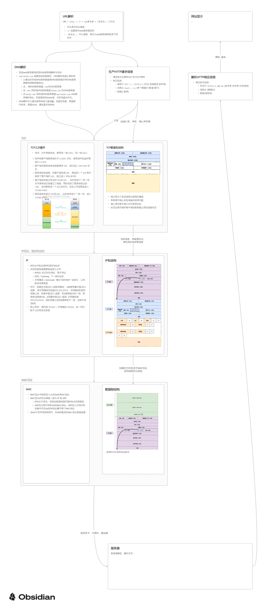

# TCP/IP 网络模型

Transmission Control Protocol 传输控制协议

## 产生原因
- 同一台设备上的进程间通信，可以有管道、消息队列、共享内存、信号等方式
- 不同设备上的进程间通信，就需要网络通信，而**设备是多样性的，所以要兼容多种多样的设备**，就协商出了一套**通用的网络协议**。

## 应用层  / Application Layer

- **关注用户**需要的功能，如HTTP、FTP、DNS、SMTP...
- 不关注数据如何传输的
- 运行在用户态

## 传输层  / Transport Layer

- TCP 基于有连接
- UDP 基于无连接

## 网络层  / Internet Layer
- 负责将数据从一个设备传递到另一个设备
- 常用的协议是IP 协议，具有寻址、路由功能。寻址在于找到目的地，路由在于选择最优路径

## 数据链路层  / Data Link Layer
- 两个网络实体之间的数据链路建立、维持、释放管理

## 链路层  / Link Layer
- 网络中主机或节点的物理和逻辑网络组件功能

# 访问网站全过程
